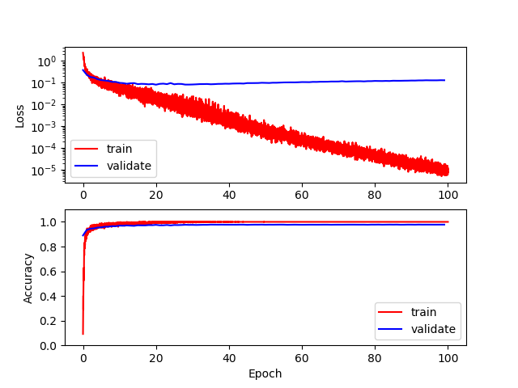
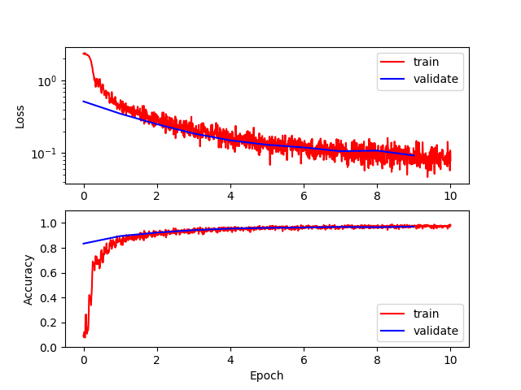
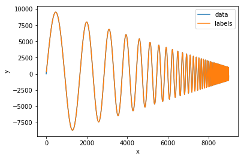
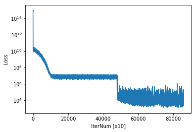
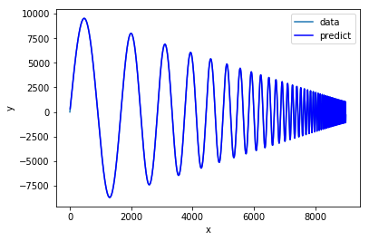
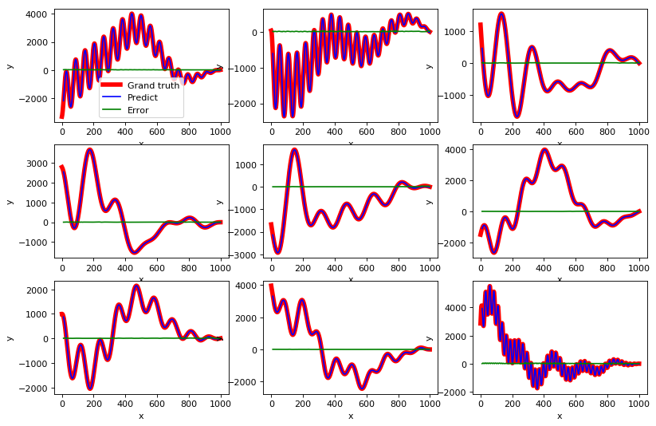

# Optimizer_with_theano
Simple deep learning or machine learning framework for now.

Manual page is [here](https://uyuutosa.github.io/Optimizer_with_theano).

You can install as type:

```sh
pip install Optimizer_with_theano
```

Test MNIST with multiclass logistic regression

```python
import Optimizer_with_theano as op
o = op.optimizer(128)
o = o.set_datasets()
o = o.dense(400, act="relu")
o.dense(30,  act="relu")
o.dense(20,  act="relu")
o.dense(10)
o.softmax().loss_cross_entropy()
o = o.opt_Adam(0.001).compile()
o = o.optimize(100, 10)
```
```
====================================
layer 0
name:Input_0
in:(784,)
out:(784,)
====================================
layer 1
name:Dense_1
in:(784,)
out:(400,)
Num of params:314000
Params:
------------------------------------
Dense_1_theta:[784 400]
Dense_1_b:[400]
------------------------------------
activation:relu
====================================
layer 2
name:Dense_2
in:(400,)
out:(30,)
Num of params:12030
Params:
------------------------------------
Dense_2_theta:[400  30]
Dense_2_b:[30]
------------------------------------
activation:relu
====================================
layer 3
name:Dense_3
in:(30,)
out:(20,)
Num of params:620
Params:
------------------------------------
Dense_3_theta:[30 20]
Dense_3_b:[20]
------------------------------------
activation:relu
====================================
layer 4
name:Dense_4
in:(20,)
out:(10,)
Num of params:210
Params:
------------------------------------
Dense_4_theta:[20 10]
Dense_4_b:[10]
------------------------------------
activation:linear
====================================
Total num. of params:326860
====================================
Epoch. 0: loss = 7.7385e-01, acc = 7.5171e-01, valid. loss = 3.3977e-01, valid. acc. = 8.9871e-01.
Epoch. 10: loss = 5.4824e-02, acc = 9.8429e-01, valid. loss = 1.0058e-01, valid. acc. = 9.6814e-01.
Epoch. 20: loss = 1.7504e-02, acc = 9.9644e-01, valid. loss = 8.7811e-02, valid. acc. = 9.7400e-01.
Epoch. 30: loss = 5.6043e-03, acc = 9.9940e-01, valid. loss = 9.0656e-02, valid. acc. = 9.7529e-01.
Epoch. 40: loss = 1.5540e-03, acc = 9.9995e-01, valid. loss = 9.7854e-02, valid. acc. = 9.7657e-01.
Epoch. 50: loss = 5.1380e-04, acc = 1.0000e+00, valid. loss = 1.0863e-01, valid. acc. = 9.7671e-01.
Epoch. 60: loss = 2.1099e-04, acc = 1.0000e+00, valid. loss = 1.1650e-01, valid. acc. = 9.7614e-01.
Epoch. 70: loss = 9.0300e-05, acc = 1.0000e+00, valid. loss = 1.2567e-01, valid. acc. = 9.7671e-01.
Epoch. 80: loss = 4.0663e-05, acc = 1.0000e+00, valid. loss = 1.3309e-01, valid. acc. = 9.7557e-01.
Epoch. 90: loss = 1.8589e-05, acc = 1.0000e+00, valid. loss = 1.4004e-01, valid. acc. = 9.7629e-01.

```


or use CNN (a little)

```python
#One linear coding suppotted(but I do not use it)..
import Optimizer_with_theano as op
o = op.optimizer(128)\
   ...:       .set_datasets()\
   ...:       .reshape((1,28,28))\
   ...:       .conv_and_pool(64,3,3, "same", act="relu")\
   ...:       .conv_and_pool(32,3,3, "same", act="relu")\
   ...:       .flatten().dense(10)\
   ...:       .softmax().loss_cross_entropy()\
   ...:       .opt_Adam(0.001).compile()\
   ...:       .optimize(10, 1)

```

```
====================================
layer 0
name:Input_0
in:(784,)
out:(784,)
====================================
layer 1
name:Reshape_1
in:(784,)
out:(1, 28, 28)
====================================
layer 2
name:Conv2D_2
in:(1, 28, 28)
out:(64, 28, 28)
Num of params:640
Params:
------------------------------------
Conv2D_2_theta:[64  1  3  3]
Conv2D_2_b:[64]
------------------------------------
activation:relu
====================================
layer 3
name:Pool_3
in:(64, 28, 28)
out:(64, 14, 14)
====================================
layer 4
name:Conv2D_4
in:(64, 14, 14)
out:(32, 14, 14)
Num of params:18464
Params:
------------------------------------
Conv2D_4_theta:[32 64  3  3]
Conv2D_4_b:[32]
------------------------------------
activation:relu
====================================
layer 5
name:Pool_5
in:(32, 14, 14)
out:(32, 7, 7)
====================================
layer 6
name:Flatten_6
in:(32, 7, 7)
out:(1568,)
====================================
layer 7
name:Dense_7
in:(1568,)
out:(10,)
Num of params:15690
Params:
------------------------------------
Dense_7_theta:[1568   10]
Dense_7_b:[10]
------------------------------------
activation:linear
====================================
Total num. of params:34794
====================================
Epoch. 0: loss = 1.0662e+00, acc = 6.4138e-01, valid. loss = 5.1562e-01, valid. acc. = 8.3400e-01.
Epoch. 1: loss = 3.6077e-01, acc = 8.9030e-01, valid. loss = 3.4957e-01, valid. acc. = 8.9457e-01.
Epoch. 2: loss = 2.4977e-01, acc = 9.2616e-01, valid. loss = 2.5022e-01, valid. acc. = 9.2300e-01.
Epoch. 3: loss = 1.8599e-01, acc = 9.4529e-01, valid. loss = 1.8645e-01, valid. acc. = 9.4257e-01.
Epoch. 4: loss = 1.4899e-01, acc = 9.5573e-01, valid. loss = 1.4960e-01, valid. acc. = 9.5529e-01.
Epoch. 5: loss = 1.2659e-01, acc = 9.6278e-01, valid. loss = 1.3016e-01, valid. acc. = 9.6086e-01.
Epoch. 6: loss = 1.1280e-01, acc = 9.6649e-01, valid. loss = 1.1962e-01, valid. acc. = 9.6400e-01.
Epoch. 7: loss = 1.0240e-01, acc = 9.6979e-01, valid. loss = 1.0614e-01, valid. acc. = 9.6857e-01.
Epoch. 8: loss = 9.5483e-02, acc = 9.7168e-01, valid. loss = 1.0817e-01, valid. acc. = 9.6614e-01.
Epoch. 9: loss = 8.8111e-02, acc = 9.7359e-01, valid. loss = 9.2609e-02, valid. acc. = 9.7114e-01.

```


We try to simple time series prediction using blow data,

```python
from numpy import *
from pylab import *
import Optimizer as op
%matplotlib inline

def gen_dataset(v, length):
    v = v.flatten()
    idx = arange(v.size)
    idx = idx[:, None] + arange(length+1)
    idx = idx[:-length]
    xidx = idx[:, :-1]
    yidx = idx[:, -1]
    x_idx_f = xidx.flatten()
    y_idx_f = yidx.flatten()
    x = v[x_idx_f].reshape(-1, 1, 1, length)
    y = v[y_idx_f][:, None]
    return x, y, xidx, yidx

v = sin(pi * arange(10000) / arange(1,10001)[::-1]*10) * arange(10000)[::-1]
x, y, xidx, yidx = gen_dataset(v, 10)

plot(arange(v.size),v)
plot(yidx.flatten(),y.flatten())
xlabel("x")
ylabel("y")
legend(["data", "labels"])
```



Trying to learn this data using bellow network(so called UFCNN)

```python
o = op.optimizer(n_batch=100)
o.set_data(x, y, test_size=0., is_shuffle=False)
o.set_variables()
o1 =  o.conv2d((1, 1, 1, 5), mode="same").relu()
o2 = o1.conv2d((1, 1, 1, 5), mode="same").relu()
o3 = o2.conv2d((1, 1, 1, 5), mode="same").relu()
o4 = o3.conv2d((1, 1, 1, 5), mode="same").relu()
o5 = o4.conv2d((1, 1, 1, 5), mode="same").relu() + o2
o6 = o5.conv2d((1, 1, 1, 5), mode="same").relu() + o1
o7 = o6.conv2d((1, 1, 1, 5), mode="same").relu()
o8 = o7.conv2d((1, 1, 1, 10), mode="valid")
o9 = o8.flatten()
o = o9.loss_mse()
o = o.opt_Adam(0.001).compile()
o = o.optimize(10000000,10)
```

Loss value can be viewed by


```python
o.view()
```



and comparing between predict and grand truth using dataset for checking.

```python
#plot(xidx.flatten(),x.flatten())
plot(arange(v.size),v)
#plot(yidx.flatten(),y.flatten())
plot(yidx, o.pred_func(x.reshape(-1, 1, 1, 10).astype(float32)).flatten(), c="b")
#xlim(0,100)
xlabel("x")
ylabel("y")
legend(["data", "predict"])
```





Lastly, evaluate the performance of this prediction model using randomly generated data as follows.

```python
figure(num=None, figsize=(12, 8), dpi=80, facecolor='w', edgecolor='k')
is_first = True
for i in range(1,10,1):
    subplot(3, 3, i)
    v = zeros(1000)
    for i in range(10):
        v += sin(pi * arange(1000) / randint(10, 1000) + randint(0, 1000)) * arange(1000)[::-1]
    x, y, xidx, yidx = gen_dataset(v, 10)
    plot(arange(v.size),v, c="r",lw=5, label="Grand truth")
    plot(yidx, o.pred_func(x.reshape(-1, 1, 1, 10).astype(float32)).flatten(), c="b", label="Predict")
    plot(yidx, abs(y.flatten() - o.pred_func(x.reshape(-1, 1, 1, 10).astype(float32)).flatten()), c="g", label="Error")

    xlabel("x")
    ylabel("y")
    if is_first:
        legend()
        is_first = False

```



This model seemed to be able to predit exactly.
However, it should be noted that this coarse evaluation does not serve as any reference.
This is a toy problem.
