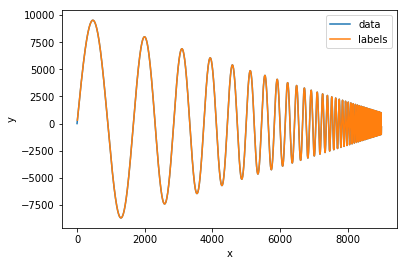
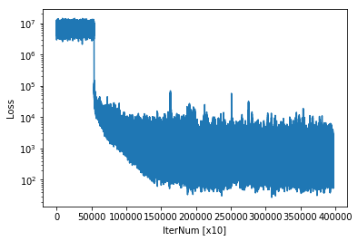
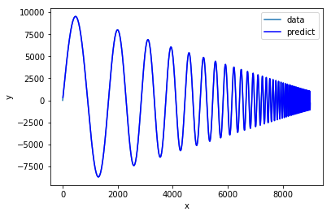
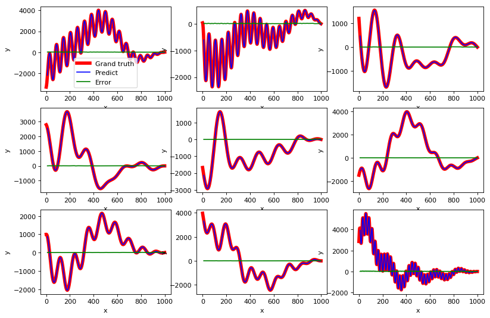

# Optimizer_with_theano
Simple deep learning or machine learning framework for now.

Manual page is [here](https://uyuutosa.github.io/Optimizer_with_theano).

You can install as type

```sh
pip install Optimizer_with_theano
```

Test mnist with multiclass logistic regression

```python
import Optimizer_with_theano as op
o = op.optimizer(100)
o = o.set_datasets("mnist")
o = o.dense(10).relu()
o = o.softmax().loss_cross_entropy()
```
```
Epoch. 0: loss = 9.3023e-01, acc = 8.3789e-01, valid. loss = 5.3073e-01, valid. acc. = 8.3789e-01.
Epoch. 10: loss = 2.9722e-01, acc = 9.1679e-01, valid. loss = 2.9326e-01, valid. acc. = 9.1679e-01.
Epoch. 20: loss = 2.6962e-01, acc = 9.2498e-01, valid. loss = 2.6693e-01, valid. acc. = 9.2498e-01.
```

or use CNN (a little)

```python
o = op.optimizer(100)\  #One linear coding suppotted(but I do not use it)..
      .set_datasets()\
      .reshape((1,28,28))\
      .conv_and_pool(2,3,3, "same")\
      .flatten().dense(10)\
      .softmax().loss_cross_entropy()
      .opt_Adam(0.01).compile()
      .optimize(10000, 10)
```

```
Epoch. 0: loss = 1.2766e+01, acc = 3.1933e-01, valid. loss = 1.0233e+01, valid. acc. = 3.1933e-01.
Epoch. 10: loss = 2.6673e-01, acc = 9.2543e-01, valid. loss = 2.5349e-01, valid. acc. = 9.2543e-01.
Epoch. 20: loss = 1.8513e-01, acc = 9.4630e-01, valid. loss = 1.7986e-01, valid. acc. = 9.4630e-01.
Epoch. 30: loss = 1.6433e-01, acc = 9.5481e-01, valid. loss = 1.5644e-01, valid. acc. = 9.5481e-01.
Epoch. 50: loss = 1.4730e-01, acc = 9.5898e-01, valid. loss = 1.3878e-01, valid. acc. = 9.5898e-01.
```

We try to simple time series prediction using blow data,

```python
from numpy import *
from pylab import *
import Optimizer as op
%matplotlib inline

def gen_dataset(v, length):
    v = v.flatten()
    idx = arange(v.size)
    idx = idx[:, None] + arange(length+1)
    idx = idx[:-length]
    xidx = idx[:, :-1]
    yidx = idx[:, -1]
    x_idx_f = xidx.flatten()
    y_idx_f = yidx.flatten()
    x = v[x_idx_f].reshape(-1, 1, 1, length)
    y = v[y_idx_f][:, None]
    return x, y, xidx, yidx

v = sin(pi * arange(10000) / arange(1,10001)[::-1]*10) * arange(10000)[::-1]
x, y, xidx, yidx = gen_dataset(v, 10)

plot(arange(v.size),v)
plot(yidx.flatten(),y.flatten())
xlabel("x")
ylabel("y")
legend(["data", "labels"])
```



Trying to learning thies data using bellow network(so called UFCNN)

```python
o = op.optimizer(n_batch=100)
o.set_data(x, y, test_size=0., is_shuffle=False)
o.set_variables()
o1 =  o.conv2d((1, 1, 1, 5), mode="same").relu()
o2 = o1.conv2d((1, 1, 1, 5), mode="same").relu()
o3 = o2.conv2d((1, 1, 1, 5), mode="same").relu()
o4 = o3.conv2d((1, 1, 1, 5), mode="same").relu()
o5 = o4.conv2d((1, 1, 1, 5), mode="same").relu() + o2 #前段の畳込み層をマージ
o6 = o5.conv2d((1, 1, 1, 5), mode="same").relu() + o1 #前段の畳込み層をマージ
o7 = o6.conv2d((1, 1, 1, 5), mode="same").relu()
o8 = o7.conv2d((1, 1, 1, 10), mode="valid")
o9 = o8.flatten()
o = o9.loss_mse()
o = o.opt_Adam(0.001).compile()
o = o.optimize(10000000,10)
```

Loss value can be viewed by


```python
o.view()
```



and comparing between predict and grand truth using dataset for checking.

```python
#plot(xidx.flatten(),x.flatten())
plot(arange(v.size),v)
#plot(yidx.flatten(),y.flatten())
plot(yidx, o.pred_func(x.reshape(-1, 1, 1, 10).astype(float32)).flatten(), c="b")
#xlim(0,100)
xlabel("x")
ylabel("y")
legend(["data", "predict"])
```





Lastly, evaluate the performance of this prediction model using randomly generated data as follows.

```python
figure(num=None, figsize=(12, 8), dpi=80, facecolor='w', edgecolor='k')
is_first = True
for i in range(1,10,1):
    subplot(3, 3, i)
    v = zeros(1000)
    for i in range(10):
        v += sin(pi * arange(1000) / randint(10, 1000) + randint(0, 1000)) * arange(1000)[::-1]
    x, y, xidx, yidx = gen_dataset(v, 10)
    plot(arange(v.size),v, c="r",lw=5, label="Grand truth")
    plot(yidx, o.pred_func(x.reshape(-1, 1, 1, 10).astype(float32)).flatten(), c="b", label="Predict")
    plot(yidx, abs(y.flatten() - o.pred_func(x.reshape(-1, 1, 1, 10).astype(float32)).flatten()), c="g", label="Error")

    xlabel("x")
    ylabel("y")
    if is_first:
        legend()
        is_first = False

```



This model seemed to be able to predit exactly.
However, it should be noted that this coarse evaluation does not serve as any reference.
This is a toy problem.
